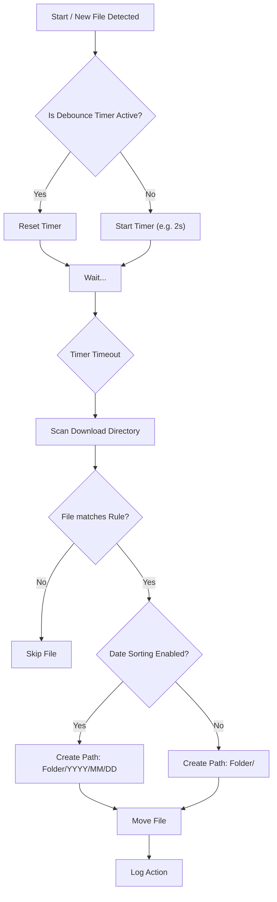

<div id="top" align="center">
<h1>GH Template with GH-Pages 📂</h1>
<p>cross-platform application to do something</p>


[](https://github.com/Zheng-Bote/ghp_template/releases)
<br/>
[Report Issue](https://github.com/Zheng-Bote/ghp_template/issues) · [Request Feature](https://github.com/Zheng-Bote/ghp_template/pulls)

</div>

<hr>

<!-- START doctoc generated TOC please keep comment here to allow auto update -->
<!-- DON'T EDIT THIS SECTION, INSTEAD RE-RUN doctoc TO UPDATE -->
**Table of Contents**

- [Description](#description)
  - [✨ Key Features](#-key-features)
  - [Status](#status)
- [Documentation & Screenshots](#documentation--screenshots)
- [⚙️ Build](#-build)
  - [Build Instructions](#build-instructions)
  - [Project Structure](#project-structure)
- [🏗️ Architecture](#-architecture)
  - [Component Overview](#component-overview)
  - [Class Diagram](#class-diagram)
  - [Sorting Flow Logic](#sorting-flow-logic)
- [🤝 Contributing](#-contributing)
- [📄 License](#-license)
- [👤 Author](#-author)
  - [Code Contributors](#code-contributors)

<!-- END doctoc generated TOC please keep comment here to allow auto update -->

<hr>

# Description


**GH Template with GH-Pages** is a Github README template, especially with Github Pages based on Jekyll.

## ✨ Key Features

- **Real-time updates with zero downtimes:** Uses xyz super features.
- **Bug-Free:** zero bugs and super stable.
- **zero costs:** running in Clouds with zero costs.

## Status

:arrow_right: <mark>:warning: still under construction :warning:</mark> :arrow_left:


[](https://github.com/Zheng-Bote/ghp_template/releases)


---

# Documentation & Screenshots

_see Github Pages_

# ⚙️ Build

**_Prerequisites_**

- C++ Compiler supporting C++23 (GCC 13+, Clang 16+, MSVC 2022 v17.6+)
- CMake (3.23 or newer)
- Qt 6 (Core, Gui, Widgets, LinguistTools)

## Build Instructions

```Bash
# 1. Clone the repository
git clone [https://github.com/Zheng-Bote/ghp_template.git](https://github.com/Zheng-Bote/ghp_template.git)
cd file-sorter

# 2. Create build directory
mkdir build && cd build

# 3. Configure with CMake
cmake -DCMAKE_BUILD_TYPE=Release ..

# 4. Build
cmake --build . --config Release

# 5. Installer packages (optional, Windows only)
cpack.exe -C Release
# in some cases (if Chocolatey is installed on your system) the complete path to your Qt cpack is needed
& "C:\Qt\Tools\CMake_64\bin\cpack.exe" -C Release
```

## Project Structure

```Plaintext
file-sorter/
├── CMakeLists.txt       # Build configuration
├── resources.qrc        # Resource file (icons, etc.)
├── resources/           # Resource files (icons, logos, for AppImage etc.)
├── include/             # Header files (*.hpp)
├── src/                 # Source files (*.cpp)
├── translations/        # Translation files (*.ts)
└── configure/           # CMake configuration scripts
```

> \[!NOTE]
> You can modify rules while "Automatic Monitoring" is active. The changes will be applied immediately.

---

([back to top](#top))

# 🏗️ Architecture

The application follows a clean separation of concerns, splitting the User Interface (UI) from the business logic.

## Component Overview

1.  **MainWindow (UI):** Handles user interaction, configuration (TableWidget), and displays logs. It manages the application lifecycle and processes optional CLI arguments (QCommandLineParser) to handle minimized starts.
2.  **FileSorter (Logic):** A `QObject` based worker class. It handles:
    - File system monitoring (`QFileSystemWatcher`).
    - Debouncing logic to wait for file write operations.
    - The actual sorting algorithm (Pattern matching & `std::filesystem`/`QDir` operations).
3.  **Config & Resources:**
    - `rz_config.hpp`: Generated by CMake for versioning and metadata.
    - `QSettings`: Stores sorting rules persistently.
    - `Qt Linguist`: Handles translations (`.ts` / `.qm`).

## Class Diagram

```mermaid
classDiagram
    class MainWindow {
        +QTableWidget* m_table
        +QTextEdit* m_logOutput
        +QCheckBox* m_autoSortCheck
        -setupUI()
        -saveSettings()
        -loadSettings()
        -onRulesModified()
    }

    class FileSorter {
        +void sortDownloads(List categories)
        +void setMonitoring(bool enable)
        +void updateRules(List categories)
        -QFileSystemWatcher* m_watcher
        -QTimer* m_debounceTimer
        -onDirectoryChanged()
    }

    class Category {
        +QString folderName
        +QStringList extensions
        +bool useDatePath
    }

    class AboutDialog {
        +AboutDialog(QWidget* parent)
    }

    MainWindow *-- FileSorter : owns
    MainWindow ..> Category : creates
    MainWindow ..> AboutDialog : shows
    FileSorter -- QFileSystemWatcher : uses
    FileSorter -- QTimer : uses
```



## Sorting Flow Logic

When Automatic Monitoring is enabled, the application follows this process:



---

([back to top](#top))

# 🤝 Contributing

Contributions are welcome! Please fork the repository and create a pull request.

1. Fork the Project
2. Create your Feature Branch (git checkout -b feature/AmazingFeature)
3. Commit your Changes (git commit -m 'Add some AmazingFeature')
4. Push to the Branch (git push origin feature/AmazingFeature)
5. Open a Pull Request

# 📄 License

Distributed under the MIT License. See LICENSE for more information.

Copyright (c) 2025 ZHENG Robert

# 👤 Author

[](https://www.github.com/Zheng-Bote)

## Code Contributors


<hr>
([back to top](#top))

:vulcan_salute:
